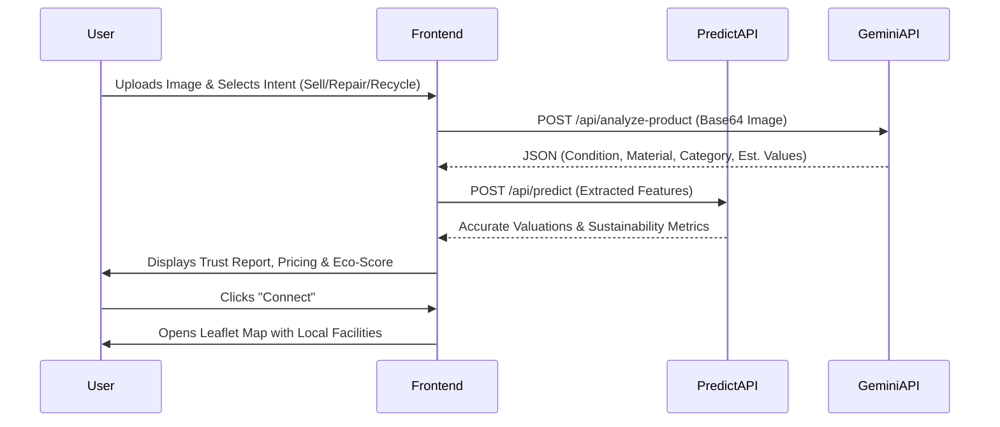

# ReGenX ♻️


## Overview

ReGenX is an intelligent, AI-powered circular economy platform built to revolutionize how we handle second-hand goods. By leveraging Google's Gemini Multimodal AI and custom valuation algorithms, ReGenX analyzes product images to determine their physical condition, estimated age, and material composition. 

The platform solves the problem of e-waste and premature product disposal by guiding users toward the most sustainable and economically viable decision: **Sell, Repair, or Recycle**. By providing instant, data-driven valuations and connecting users with local facilities, ReGenX empowers individuals to reduce their carbon footprint while maximizing the value of their used items.

## Key Features

*   🧠 **AI-Powered Product Analysis**: Upload an image of a product, and the Gemini API automatically identifies the brand, condition, and material composition.
*   💰 **Algorithmic Valuation Engine**: A custom prediction API calculates precise resale values, repair costs, and scrap values using real-world depreciation and material rates.
*   🌱 **Sustainability Dashboard**: Real-time tracking of your environmental impact, including CO2 saved, water conserved, and a personalized "Circular Economy Score."
*   🗺️ **Local Facility Mapping**: Interactive maps (via Leaflet) to find nearby repair shops, recycling centers, or second-hand buyers based on your selected action.
*   📜 **Eco-Certificate Generation**: Rewards users for recycling by generating downloadable, shareable PDF certificates using `jspdf` and `html2canvas`.
*   📦 **Digital Twin History**: Tracks all analyzed items in a local dashboard, providing a detailed "Trust Report" and history for every product.
*   🌐 **Multi-Language Support**: Fully localized interface supporting English, Hindi, and Hinglish.

## System Architecture

ReGenX follows a modern, serverless architecture using Next.js App Router.

*   **Frontend Layer**: Client-heavy React components managing complex states (file uploads, drag-and-drop, animations). It utilizes `localStorage` for rapid, persistent client-side data storage.
*   **Backend Layer**: Next.js Route Handlers act as a secure proxy and business logic layer.
*   **AI Layer**: Direct REST integration with Google's Gemini 1.5/2.5 Flash models for computer vision and JSON-structured data extraction.
*   **Authentication Layer**: Firebase Authentication handling user sessions.

```mermaid
graph TD
    Client[Client Browser]
    
    subgraph Next.js Application
        UI[React UI Components]
        Local[LocalStorage / State]
        
        API_Predict[/api/predict]
        API_Analyze[/api/analyze-product]
    end
    
    subgraph External Services
        Gemini[Google Gemini API]
        Firebase[Firebase Auth]
        OSM[OpenStreetMap / Leaflet]
    end

    Client <-->|Interacts| UI
    UI <-->|Saves History| Local
    UI -->|Auth| Firebase
    UI -->|Image Payload| API_Analyze
    UI -->|Feature Payload| API_Predict
    UI -->|Map Tiles| OSM
    
    API_Analyze -->|REST Prompt| Gemini
```

## Technology Stack

### Frontend
| Technology | Version | Purpose |
|------------|---------|---------|
| Next.js | 14.2.5 | React Framework & Routing |
| React | 18.3.1 | UI Library |
| React-Leaflet | 4.2.1 | Interactive Maps |
| html2canvas | 1.4.1 | DOM to Image (Certificates) |
| jsPDF | 4.2.0 | PDF Generation |
| QRCode | 1.5.4 | Certificate Verification |

### Backend & Services
| Technology | Version | Purpose |
|------------|---------|---------|
| Next.js API Routes | 14.2.5 | Serverless Backend |
| Firebase | 12.9.0 | Authentication |
| Google Gemini API | REST | AI Vision & Analysis |

## Project Structure

```text
ReGenX/
├── app/
│   ├── api/
│   │   ├── analyze-image/     # Legacy/Alternative AI route
│   │   ├── analyze-product/   # Primary Gemini AI Vision route
│   │   ├── predict/           # Algorithmic valuation engine
│   │   └── test-ai/           # AI connectivity diagnostics
│   ├── components/
│   │   ├── MapView.jsx        # Leaflet map integration
│   │   └── SustainabilityDashboard.jsx # Eco-metrics visualization
│   ├── history/
│   │   └── page.js            # User product history & certificates
│   ├── lib/
│   │   ├── firebase.js        # Firebase configuration
│   │   ├── sustainabilityData.js # Static eco-impact data models
│   │   ├── worldLocations.js  # Geolocation data
│   │   └── userService.js     # User profile operations
│   ├── login/
│   │   └── page.js            # Firebase authentication flow
│   ├── sustainability/
│   │   └── page.js            # Dedicated eco-impact dashboard
│   ├── globals.css            # Primary vanilla CSS design system
│   ├── layout.js              # Next.js root layout
│   └── page.js                # Massive core application logic (4000+ lines)
├── next.config.mjs            # Next.js build & caching configuration
├── package.json               # Dependencies
└── vercel.json                # Vercel deployment & security headers
```

## User Workflows

### Main Functional Flow



## Database Design

*Not identifiable from source code.* 

While Firebase Firestore is initialized in `app/lib/firebase.js`, the core application relies entirely on browser `localStorage` for state management, including:
*   `regenxUser` / `regenxProfile`: User session data.
*   `regenxProductHistory`: Analyzed product digital twins.
*   `regenxImageCache`: Cached AI responses to save API calls.

## API Documentation

### `POST /api/analyze-product`
**Purpose**: Analyzes a product image using Google Gemini to extract structural data.
*   **Request Body**: `{ "imageBase64": "...", "mimeType": "image/jpeg" }`
*   **Response**: JSON containing `productName`, `condition`, `damageLevel`, `materialType`, `bestAction`, etc.

### `POST /api/predict`
**Purpose**: Calculates precise valuations based on extracted features and depreciation logic.
*   **Request Body**: `{ "category": "electronics", "original_price": 10000, "condition_score": 0.8, "material_weight": 1.5, ... }`
*   **Response**: JSON containing `predictions` (resale_value, repair_cost, scrap_value) and `sustainability` metrics.

### `GET /api/test-ai`
**Purpose**: Diagnostic endpoint to verify Gemini API key configuration.

## Authentication & Authorization

Authentication is handled via **Firebase Auth**.
1. Users navigate to `/login`.
2. Users authenticate using Google OAuth Provider (`signInWithPopup`).
3. Upon success, user data is stored in `localStorage` (`regenxUser`).
4. Route protection is handled client-side using `onAuthStateChanged` within `useEffect` hooks, redirecting unauthenticated users back to `/login`.

## AI/ML Components

**Model**: Google Gemini (`gemini-2.5-flash` / `gemini-1.5-flash`) via REST API.
**Pipeline**:
1. User uploads a standard image (JPEG/PNG/WEBP).
2. Image is converted to Base64.
3. Payload is sent to Gemini with a highly specific system prompt enforcing a strict JSON output structure.
4. Gemini infers the product's age, physical wear, material composition, and repairability.
5. The JSON response is parsed, validated, and merged into the local Prediction API for final value calculation.

## Security Features

### Implemented
*   **Vercel Security Headers**: Configured in `vercel.json` and `next.config.mjs` (X-DNS-Prefetch-Control, Strict-Transport-Security, X-Frame-Options, X-Content-Type-Options).
*   **Client-Side Image Validation**: Enforces a 5MB limit and valid mime types (JPG, PNG, WEBP) before processing.

### Recommended Future Improvements
*   Move hardcoded Firebase API keys from `app/lib/firebase.js` to `.env.local`.
*   Migrate `localStorage` data to a secure backend database to prevent client-side tampering of Eco-Scores and pricing.
*   Implement server-side route protection (middleware) instead of relying solely on client-side `useEffect` redirects.

## Performance Considerations

*   **Caching**: `next.config.mjs` implements aggressive caching for images and static assets (`Cache-Control: public, max-age=31536000, immutable`).
*   **AI Caching**: The frontend implements an `imageHash` cache in `localStorage` to prevent duplicate Gemini API calls for identical images.
*   **Bottlenecks Observed**: `app/page.js` is extremely large (>4000 lines) and manages global state locally. This could lead to reconciliation bottlenecks on lower-end devices.

## Installation Guide

### Prerequisites
*   Node.js 18+
*   NPM or Yarn
*   Firebase Project (for Auth)
*   Google Gemini API Key

### Environment Setup
Create a `.env.local` file in the root directory:
```env
GEMINI_API_KEY=your_gemini_api_key_here
```

### Local Development
```bash
# Install dependencies
npm install

# Start the development server
npm run dev
```
Navigate to `http://localhost:3000`.

### Build Process
```bash
npm run build
npm run start
```

## Environment Variables

| Variable | Description | Required |
|----------|-------------|----------|
| `GEMINI_API_KEY` | Google Generative AI key for multimodal image analysis. | Yes |

*(Note: Firebase configurations are currently hardcoded in `app/lib/firebase.js` and should be moved to environment variables).*

## Future Roadmap

Based on the current architecture, future enhancements include:
*   **Backend Migration**: Migrating `localStorage` history to Firebase Firestore for cross-device synchronization.
*   **Component Refactoring**: Breaking down the monolithic `app/page.js` into smaller, reusable React components.
*   **State Management**: Implementing React Context or Zustand to replace prop-drilling and scattered local states.

## Contributing Guide

1. Fork the repository.
2. Create your feature branch (`git checkout -b feature/AmazingFeature`).
3. Commit your changes (`git commit -m 'Add some AmazingFeature'`).
4. Push to the branch (`git push origin feature/AmazingFeature`).
5. Open a Pull Request.

## License

*No license file detected.*

## Acknowledgements

*   Built with [Next.js](https://nextjs.org/)
*   Maps powered by [Leaflet](https://leafletjs.com/) and [OpenStreetMap](https://www.openstreetmap.org/)
*   AI Powered by [Google Gemini](https://deepmind.google/technologies/gemini/)
